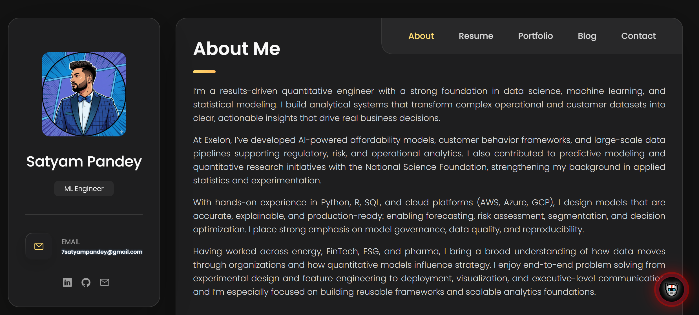
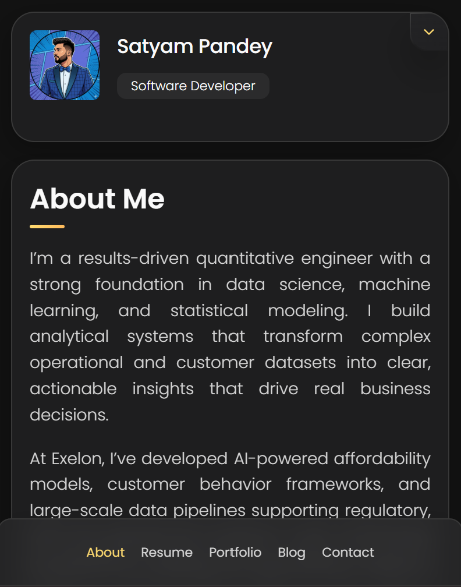

# **Satyam Pandey – Personal Portfolio**

Welcome to the source code of my **interactive personal portfolio website**, built to showcase my work in **Quantitative Engineering, Data Science, Machine Learning, and Software Development**.

The portfolio is fully responsive, minimalistic, and includes a custom-built **AI-style chatbot** that answers questions about my background, skills, and projects.

---

## 🔗 **Live Website**

👉 **[https://satyamamarpandey.github.io](https://satyamamarpandey.github.io)**

---

## 📸 **Preview**

### **Desktop**



### **Mobile**



---

## ✨ **Features**

* Modern, responsive dark-theme UI
* Smooth transitions & reveal-on-scroll animations
* Filterable Project Portfolio
* Dynamic rotating role title
* Custom **Satyam Bot** – a lightweight chatbot that:

  * Answers questions about my background
  * Provides resume links
  * Offers interactive responses
* Clean typography and minimal design
* Optimized for GitHub Pages deployment

---

## 🛠️ **Tech Stack**

| Category   | Tools                                                    |
| ---------- | -------------------------------------------------------- |
| Frontend   | HTML5, CSS3, JavaScript                                  |
| Design     | Custom CSS, SVG icons, gradients                         |
| Deployment | GitHub Pages                                             |
| Extras     | Custom Chatbot JS, Scroll Animations, Responsive Layouts |

---

## 📂 **Project Structure**

```
/
├── assets/
│   ├── css/               # Stylesheets
│   ├── images/            # Icons, project thumbnails
│   └── js/                # Main JS + chatbot script
│
├── index.html             # Main portfolio page
└── README.md              # Documentation
```

---

## 🚀 **Running Locally**

Make sure Git is installed.

### Clone the repo

```bash
git clone https://github.com/satyamamarpandey/satyamamarpandey.github.io
cd satyamamarpandey.github.io
```

### Open the project

Simply open `index.html` in your browser.

---

## 🎯 **Sections Included**

* About Me
* Experience
* Projects (Quant · Finance · Data Science · Software)
* Skills
* Education
* Contact
* Satyam Bot (AI Chat Widget)

---

## 📬 **Contact**

Feel free to reach out:

📧 Email: **[7satyampandey@gmail.com](mailto:7satyampandey@gmail.com)**
💼 LinkedIn: [https://www.linkedin.com/in/pandeysatyam](https://www.linkedin.com/in/pandeysatyam)
🌐 Portfolio: [https://satyamamarpandey.github.io](https://satyamamarpandey.github.io)
